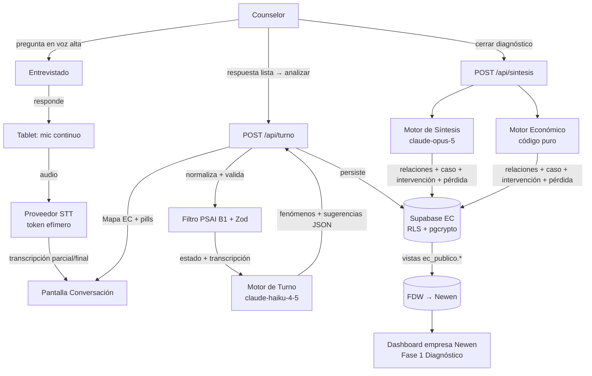

# ARCHITECTURE — KY

> Arquitectura completa de KY: componentes, flujo de datos, integraciones y modelo de
> seguridad. Detalle de método en `spec/metodo-ec/`; plan y trade-offs en `spec/PLAN_APROBADO.md`.

## Stack

| Capa | Tecnología | Versión |
|---|---|---|
| Framework | Next.js (App Router, PWA) | 15 |
| UI | React + TypeScript | 19 + 5.x |
| Estilos | Tailwind CSS | 4 |
| DB / Auth | **Supabase (proyecto propio de EC)** — Postgres + Auth + RLS + pgcrypto | — |
| IA | API de Claude vía Route Handlers (BFF). Turno: `claude-haiku-4-5`. Síntesis: `claude-opus-5`. `output_config.format` para salidas estructuradas. | SDK `@anthropic-ai/sdk` |
| STT | Proveedor de tiempo real es-AR (Deepgram / AssemblyAI / Azure — a confirmar) vía token efímero | — |
| Rate limit | Upstash Redis | `@upstash/ratelimit` |
| Deploy | Vercel (proyecto separado del de Newen) | — |
| Integración Newen | Supabase `Wrappers` / `postgres_fdw` de solo lectura | — |

## Diagrama de flujo (entrevista)

## Componentes

- **Frontend (tablet, PWA)** — pantallas Inicio / Conversación / Resultado / Intervención.
  Captura de audio, cola offline (IndexedDB), Mapa EC en vivo. No llama a Claude ni al STT con
  credencial permanente.
- **Route Handlers (BFF)** — `/api/turno`, `/api/sintesis`, `/api/sintesis/mensaje`,
  `/api/stt/token`, `/api/diagnostico/*`. Validan (Zod), aplican rate limit, normalizan
  (PSAI B1), llaman a los modelos, persisten en Supabase.
- **Núcleo de dominio (`lib/diagnostico/`)** — puro, sin IO: `matriz.config`,
  `mapa-indagacion.config`, `contexto-comun`, `clasificador` (DOMINANTE + caso 1–4),
  `motor-economico`, `schemas`, `prompts/`.
- **Supabase EC** — tablas base + RLS + `pgcrypto` + vistas `ec_publico.*` + rol `newen_reader`.
- **Motores de IA** — turno (rápido, 8–15×), síntesis (pesado, 1×), redacción de mensaje de
  cierre (liviano, 1×). El motor económico NO usa IA.

## Modelo de datos

Ver `spec/DATA_MODEL.md` y `spec/init_schema.sql`. Entidades: `empresa`, `diagnostico`,
`datos_economicos`, `respuesta_cruda`, `fenomeno_detectado`, `relacion_fenomeno`,
`reversibilidad`, `perdida_economica`, `intervencion_propuesta`, `consentimiento`,
`consentimiento_textos`, `llamada_ia`.

## Integración con Newen

Dos proyectos Supabase. Newen consume vistas de solo lectura de EC vía FDW. Match por
`empresa.organization_client_id` (FK lógico, se completa cuando el prospecto se vuelve cliente).
El resultado de KY alimenta la **Fase 1 (Diagnóstico)** del ciclo de 6 fases del dashboard de
empresa de Newen — no lo reemplaza. `respuesta_cruda` nunca sale de EC.

## Seguridad

PSAI v1.3 + Protocolo Maestro. Ver `SECURITY.md`. Puntos clave: BFF, token efímero STT,
RLS por counselor, `pgcrypto` en campos sensibles, rate limit, filtro B1 sobre la
transcripción, validación B4 sobre outputs, protocolo de crisis (`alerta_seguridad`),
aislamiento total de `respuesta_cruda` respecto de Newen.
